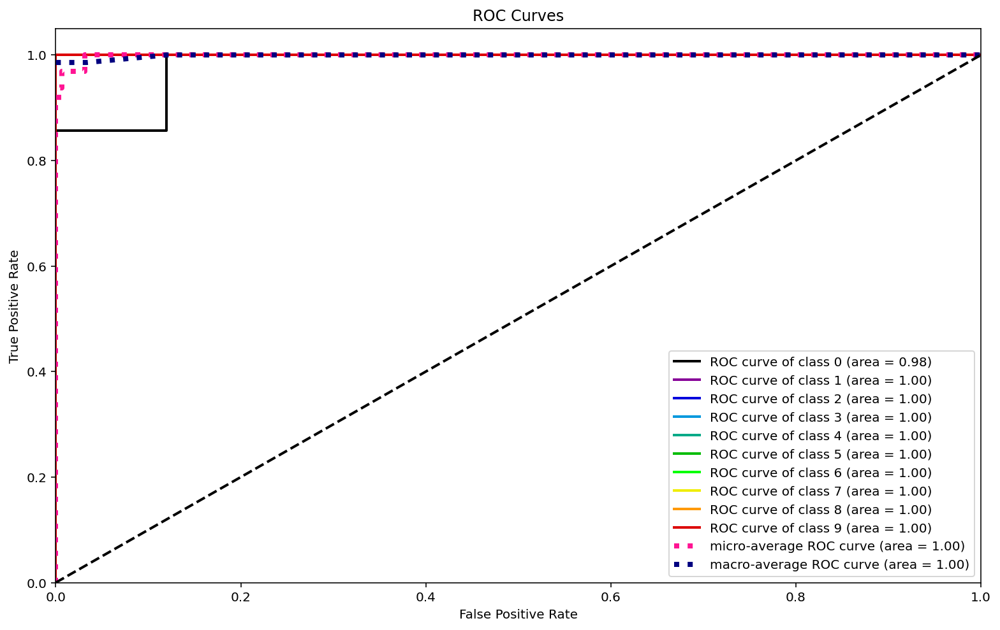

+++
title = "how to die"
date = 2019-12-08
description = "Hugo, the world's fastest framework for building websites"
aliases = ["about-us", "about-hugo", "contact"]
author = "Hugo Authors"
comments = false
+++

$$
\int_0^{\infty}
$$



```python
import uproot 
import pathlib as path
import matplotlib.pyplot as plt
import matplotlib

from pprint import pprint
import torch

import numpy as np
import matplotlib.pyplot as plt
from torch.utils.data import Dataset, DataLoader, random_split
from torchvision import transforms, utils
from collections import defaultdict

import os

from torch import nn
from torch.nn import functional as F
import pytorch_lightning as pl
from pytorch_lightning.metrics.functional import accuracy
from pytorch_lightning import Trainer, seed_everything
from IPython.display import set_matplotlib_formats, clear_output
set_matplotlib_formats('retina')
import scikitplot as skplt

seed_everything(666)

plt.rcParams['figure.figsize'] = (13.0, 8.0)
```
